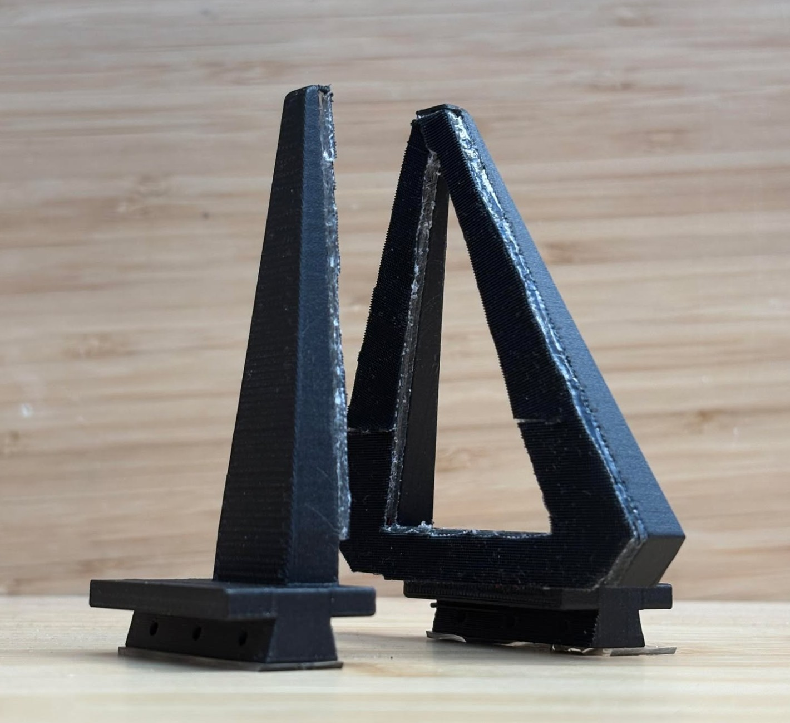
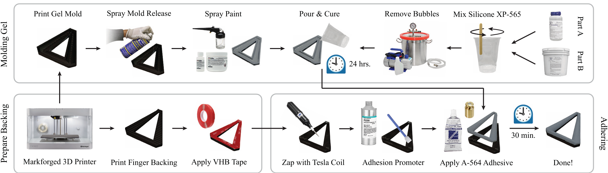

# Grasp EveryThing (GET)

    

The **Grasp EveryThing (GET)** gripper is a novel 1-DoF, 3-finger design for securely grasping objects of many shapes and sizes. Mounted on a standard parallel jaw actuator, the design features three narrow, tapered fingers arranged in a two-against-one configuration, where the two fingers converge into a V-shape. The GET gripper is more capable of conforming to object geometries and forming secure grasps than traditional gripper designs with two flat fingers. Inspired by the principle of self-similarity, these V-shaped fingers enable secure grasping across a wide range of object sizes. Further to this end, fingers are parametrically designed for convenient resizing and interchangeability across robotic embodiments with a parallel jaw gripper. Additionally, we incorporate a rigid fingernail to enhance small object manipulation. Tactile sensing can be integrated into the standalone finger via an externally-mounted camera. A neural network was trained to estimate normal force from tactile images with an average validation error of 1.3~N across a diverse set of geometries.

Paper pre-print is available on [arXiv](http://arxiv.org/abs/2505.09771).

    

## Hardware Fabrication

In the `hardware` folder of this repository, you will find all CAD files needed to replicated versions of these fingers compatible for use with ALOHA teleoperation system, Franka Panda arm, and UMI gripper. Detailed fabrication instructions are provided below. Simplified versions of the fingers can be built without tactile sensing or silicone gels for more convenient fabrication.

    

### GET Fingers without Silicone Gels

We can use VHB tape as substitute for silicone gels on GET fingers. This allows users to create GET fingers without the need for wet lab experience in silicone molding. This offers a more convenient fabrication process for modest performance tradeoff. In fact, high friction tape may even improve grasp stability.

#### Fabrication Steps:
1. Navigate to `hardware/fingers_without_gel` and download CAD files for selected robotic platform.
    - If necessary, augment existing CAD files for custom robotic platform.
2. 3D print backings for single finger and two finger sides.
3. Apply 2 layers of [3M 4910 VHB Tape](https://www.amazon.com/3M-Scotch-4910-VHB-Tape/dp/B00I4E4NE8/ref=sr_1_3?crid=2LR3ESU4Y14A3&dib=eyJ2IjoiMSJ9.E-0ccuhN4wRZv5wW0tJ5sYoJXhxRV2Yr4exkAXYVv8F5SFn1feRQoumKWXLOkmhiBzYkbN49reyxtqGsFnDMEWhcarDRlvmzMjIyqt0SWGzTMJD3lvwv0vU7kFssLIHtJZYDoZQV-wOLg61weB2InJzeptR-m-xux2qmM7ryEPwTT8akYwTMyBGYvACKAM-Jjq0dMgS5a7l9zjADix69-rvnTTfzBINUPTWGvITwf9Y.DThggymZ5Vcj3ng81rfidRJGM9z5AMcYpgz_NVlfntQ&dib_tag=se&keywords=vhb+tape+1+mm+clear&qid=1743439963&sprefix=vhb+tape+1+mm+clea%2Caps%2C88&sr=8-3) (1mm thickness) along the surface of each finger. Use pressue along the corner of a table to remove bubbles. Cut off excess tape using an xacto knife.
4. Apply a layer of high-friction [3M TB641 Grip Tape](https://www.amazon.com/3M-Gripping-Material-TB641-Black/dp/B0093CQPW8/ref=sr_1_1?crid=161C15JKJFBZE&dib=eyJ2IjoiMSJ9.KAG2MFv4tORLFv90ntAB_jdL0WzTqeIeK_Nvzewuat3GjHj071QN20LucGBJIEps.RAhzacEEuqrGGfVMeVryOiu5fh4kqbgkqFuVmDGr9fM&dib_tag=se&keywords=3m+TB631&qid=1741804241&s=industrial&sprefix=3m+tb631%2Cindustrial%2C104&sr=1-1) on top of the VHB tape for all fingers.
5. Attach the fingers to your robot gripper.

 

### GET Fingers with Silicone Gels

Standard finger designs can be built without tactile sensing for applications where high-resolutionc camera-based tactile sensing is not needed or desired. This will maintain gripper performance without the need to manufacture or configure electronic components. In our experience, this process creates fingers that are capable of enduring at least 1000 usage cycles without any noticeable signs of wear.

    

#### Fabrication Steps:
1. Navigate to `hardware/fingers` go to selected robotic platform. Download CAD files for `two_finger` and `one_finger_no_tactile` designs.
    - If necessary, augment existing CAD files for custom robotic platform.
2. 3D print backings and gel molds for single finger and two finger sides.
3. Mix and degas silicone XP-565 in a 18:1 mass ratio.
4. Mix Print-On® gray ink base is combined with silicone ink catalyst in a 10:1 mass ratio. Thin out with NOVOCS solvent and load into airbrush.
5. Spray mold with Smooth-On Universal™ Mold Release before being airbrushing with a thin, opaque layer of paint.
6. Pour degassed silicone gel and wait 24-48 hours for the silicone to cure.
7. Apply a layer of [3M 4905 VHB Tape](https://www.amazon.com/Double-x15-4Ft-Mounting-Adhesive-Waterproof/dp/B0D12C31S2/ref=sxin_16_pa_sp_search_thematic_sspa?content-id=amzn1.sym.1ac62dee-1169-4bf4-91b9-84fe33c930b1%3Aamzn1.sym.1ac62dee-1169-4bf4-91b9-84fe33c930b1&crid=3JL7ENQWMIZB4&cv_ct_cx=3m+4905+vhb+tape&keywords=3m+4905+vhb+tape&pd_rd_i=B0D12C31S2&pd_rd_r=a9e93f69-ce09-4f5f-8638-31205c348ec2&pd_rd_w=rSB2L&pd_rd_wg=UWHBt&pf_rd_p=1ac62dee-1169-4bf4-91b9-84fe33c930b1&pf_rd_r=FA6H748H6KKA5CW2NABW&qid=1743442009&sbo=9ZOMT9Jm0JH%2Ft%2BWi68iDSA%3D%3D&sprefix=3m+4905+vhb+tap%2Caps%2C102&sr=1-1-6024b2a3-78e4-4fed-8fed-e1613be3bcce-spons&sp_csd=d2lkZ2V0TmFtZT1zcF9zZWFyY2hfdGhlbWF0aWM&psc=1) to each finger backing.
8. Once gels are cured, mix A-564 Medical Adhesive with a small amount of NOVOCS solvent and begin to degas. The following steps should be rapidly completely.
9. Zap across the surface of VHB tape with a tesla coil. 
10. Then, spread a thin layer of DOWSIL™ P5200 Clear Adhesion Promoter across the surface. Wait 1-2 min and then apply another layer.
11. Immediately after this, spread the degassed A-564 Medical Adhesive across the surface of the VHB tape. Placed cured gels on top with small weights to ensure a secure bond. Leave to cure for 20-30~min.
12. Attach the fingers to your robot gripper.

 

### GET Fingers with Tactile Sensing

For full capabilities of GET fingers, including high-resolution, camera-based tactile sensing, fabrication processes must be completed for silicone gels and necessary electronic components. 

#### Fabrication Steps:
1. Navigate to `hardware/fingers` go to selected robotic platform. Download CAD files for `two_finger` and `one_finger_tactile` designs.
    - If necessary, augment existing CAD files for custom robotic platform.
2. 3D print all `.stl` files in subfolders for the single finger and two finger sides. 
    - This includes molds for each finger's gel, plastic backings, front casing for the single finger, and the camera stalk.
3. Follow steps from the previous section to fabricate the two finger side of the gripper. As these fingers do not incorporate tactile sensing, the process remains the same.
    - These steps can be done simultaneously as your perform them for the single finger sensor. It is helpful to pour and cure gels first as this the longest part of the process. 
4. Lasercut acrylic pieces out of 3mm acrylic from `.dxf` file in selected directory.
5. (Optional) Apply gray and diffusion filters along each side lenght-wise of the acrylic piece. For gray filter, use VViViD Smoke Black Adhesive Headlight Wrap. For diffusion filter, use 3M Diffuser 3635-70.
6. Superglue the acrylic piece into place on the single finger plastic backing.
7. Follow steps from the previous section to mold and adhere single finger gels onto the acrylic piece.
8. Solder LED arrays. 
    - In the standard design, blue 1.8mm lensed LEDs are soldered onto a 0.6mm thick PCB board sized by finger width. 0.75mm thick red and green SMD LEDs (1206 package) are soldered onto 0.6mm thick PCB boards sized by finger length. In each directory, `.brd` files are included for necessary PCB boards.
    - Alternatively, each LED board could be replaced by flexible COB LED strips, which can be customized to different lengths. These are much easier to work with but result in less uniform illumination.
9. Superglue LED arrays into place along the single finger's front casing.
10. Connect LEDs to a PCB board with 3 resistors, one for each lighting channel. 
    - These resistor values may need to be recalibrated based on finger geometry and chosen LEDs. 
    - For soldered arrays on an ALOHA finger, we used resistor values of 45, 400, and 600~$\Omega$ for red, green, and blue respectively.
11. Connect resistor board to 3.3V power on Raspberry Pi.
12. Attach camera stalk to the single finger backing with M2.5 bolts, while tucking the resistor PCB board underneath the housing. Use VHB tape to securely attach an IMX708 camera in place at the top of the stalk facing the center of the finger.
13. Connect IMX708 camera to Raspberry Pi and follow steps below to begin streaming.
14. Once done, attach the fingers to your robot gripper.

### Cleaning

If the acrylic backing becomes dirty and tactile vision is occluded or blurred, the backing can be cleaned using NOVOCS solvent and Kimtech low-lint wipes.

 

## Software & Tactile Streaming

To setup streaming from tactile sensing fingers, please refer to `software` folder. Here, you will need to follow `software/imaging_driver/README.md` to install the imaging driver onto a Raspberry Pi. Once this is done, you can execute the imaging driver, connect to your local computer, and run `software/get_tactile_video.py` to stream images from the camera.
