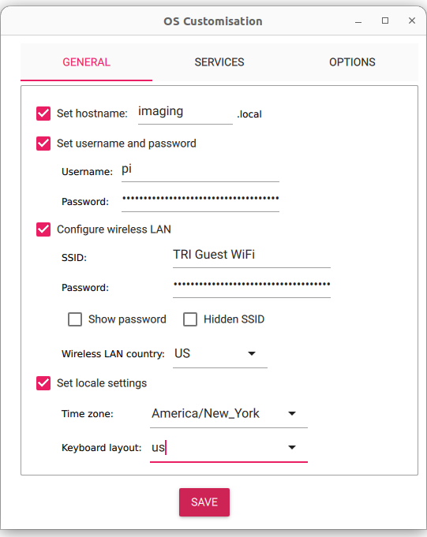

# Raspberry Pi firmware for camera and audio streaming

## Burning the OS

1. Download and install the latest firmware to your Raspberry Pi using the [Raspberry Pi Imager](https://www.raspberrypi.com/software/). The latest 64-bit Raspberry Pi OS is recommended. On the OS customisation page, setup hostname to `imaging.local`, username to `pi` and password, WiFi, and locale (needed otherwise WiFi will be disabled) according to below.



On the `Services` panel, select `Enable SSH` and `Use password authentication` so that we will be able to SSH into the Pi without needing a monitor.


2. After burning the firmware, start the rpi and connect it to your computer with ethernet. On your computer, set IPv4 address to Link-Local only. Upon boot up, you should be able to `ssh pi@imaging.local` with the password you chose.

## Installing this package

Note that you shouldn't need to install any addition packages if you do not plan to use the rpi to stream audio (we currently do not). That means all the installation should be do-able without the rpi having an internet connection. Once the rpi is booted up, run the following command on your workstation to copy this repository to rpi:

```sh
bash bash_scripts/sync_code_to_pi.sh
```

Then ssh to your rpi, `cd imaging_driver` then `sudo bash install.sh` which will install the system service to start streaming on system boot.

## Stream audio

If you also want the rpi to stream audio, you will need to run `sudo apt-get install python3-pyaudio` on your rpi, which requires internet connection.

## Network setup for robot stations

First ssh to your rpi, then run `sudo nmtui` and navigate to `Edit a connection` -> `Wired Connection`. Set `IPv4 Configuration` to `Link-Local`, and `IPv6 Configuration` to `Disabled`. 


## Using RPi camera module v3

The finger uses RPi camera module v3 as its main camera due to its higher dynamic range. However, your raspberry pi might not be able to find it automatically by default. Use command `libcamera-hello --list-cameras` to list all connected cameras. If this command does not show your camera (which should be listed as `imx708`, the model name of the sensor), do the following.

```sh
sudo nano /boot/firmware/config.txt
```

Find the line `camera_auto_detect=0` and change it to `camera_auto_detect=1`.
Then under [all], add the following 2 lines:

```sh
dtoverlay=imx708,cam1 # if a v3 camera is attached to the cam1 connector of rpi5
dtoverlay=ov5647,cam0 # if a v1 camera is attached to the cam0 connector of rpi5
```

or if you are using a rpi4 or older, add a single line:
```sh
dtoverlay=imx708 # if a v3 camera is attached
```

Use the correct camera name and port name. Note that only Raspberry Pi 5, or Raspberry Pi Compute Modules have 2 camera ports. Other Pi's (Model 4, Model 3, etc) only has `cam0`.

## (Optional) use the hardware WDR (wide dynamic range) of camera module v3

The camera module v3 has a hardware WDR mode, which increases the dynamic range at the cost of a higher level of color noise. While I decided not to use this mode, you can try it and decide for yourself whether it's worth the cost for your application.

First find the device name of the v3 camera, by running 

```sh
v4l2-ctl -d /dev/v4l-subdev0 -l
``` 

over ssh. The v3 camera module will have an configuration entry named `wide_dynamic_range`, and the device name should look similar to `/dev/v4l-subdev5`.

Then, run the following to turn on WDR

```sh
v4l2-ctl --set-ctrl wide_dynamic_range=1 -d [your device name, e.g. /dev/v4l-subdev5]
``` 

or if you decide to not use it, 

```sh
v4l2-ctl --set-ctrl wide_dynamic_range=0 -d [your device name]
``` 