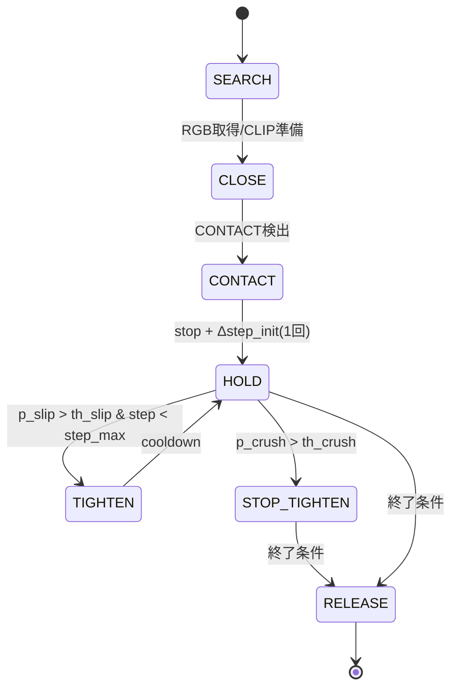

# Todo
- [x] RealSenseSDKのインストール
- [x] RealSense-ROS2のインストール
- [x] OpenCLIPのテスト
	- [x] uvの仮想環境を整える
	- [x] スクリプト作成
- [x] グリッパーの初期位置キャリブレーション、テスト
	- [x] 126/2-27.8mm
	- [x] 記録: 68.0mm = 0 step (encoder: 21077, pulses: 0)
	- [x] 記録: 40.0mm = -200 step (encoder: 25619, pulses: -200)
	- [x] -は開く方向
- [ ] かんたんなモーション作成（接触-> 停止まで）
- [ ] データ取得用のモーション-スクリプト作成

## 方針
# 1日スコープ：soft×3 / hard×3 データ収集 → 状態推定（slip/crush）学習  
**方針 / ToDo / モデル図 / 制御フロー図**（統合版）

更新日: 2026-01-21

---

## 0. 前提（現状できていること）
- GelSight差分エネルギーから **CONTACT / NON_CONTACT** 判定ができている。
- 光外乱への対策は完了している（前提）。
- 次の目的は **trial単位のデータ収集を成立させ、状態推定モデル（p_slip/p_crush）を学習し、制御に接続**すること。
- Realsense(/camera/camera/color/image-> OpenCLIPでの**Soft/Hard**判定
---

## 1. 目的（1日で達成する範囲）
- **データ収集（trial単位）を成立**させる（soft×3 / hard×3）。
- trialごとに最低限のログとラベル（slip/crush/success）を揃える。
- 余力があれば、OpenCLIP埋め込みの事前計算・最小学習まで回せる状態を作る。

> 1日で「モデルを高精度化」よりも、**ログ形式・同期・ラベル・クラスバランス**を成立させる方が重要。

---

## 2. 学習（状態推定中心）の設計

### 2.1 予測したい出力（推奨）
- `p_slip`：滑り確率（0〜1）
- `p_crush`：過変形（潰し）確率（0〜1）
- （任意）`success`：保持成功（0/1）

### 2.2 入力（推奨）
- RealSense RGB（把持前1枚） → **OpenCLIP埋め込み `z_clip`**（freeze運用）
- GelSight（接触後の短い窓）：
  - `rawRGB` K枚（例：K=3〜5）
  - `diffRGB` K枚（同タイミング）
- **contact_start** を基準に窓切り出し（同期を単純化）

### 2.3 学習モデル方針（短期推奨）
- OpenCLIPは **凍結（freeze）**して `z_clip` を得る（事前計算でも可）
- 触覚は小型CNN（raw枝＋diff枝）
- 融合は Late Fusion：`concat(z_clip, z_raw, z_diff)` → MLP → `p_slip/p_crush`

---

## 3. 作るモデルの図（データフロー / アーキテクチャ）

### 3.1 推論時の全体データフロー（推奨構成）
```text
RealSense RGB (pre-grasp) ──▶ OpenCLIP (freeze) ──▶ z_clip ───────────────┐
                                                                           │
GelSight raw/diff (post-contact window) ─▶ Tactile Encoder (CNN) ─▶ z_t ───┼─▶ Fusion Head (MLP) ─▶ p_slip, p_crush
                                                                           │
Motor/State (optional) ────────────────────────────────────────────────────┘
```

### 3.2 Mermaid（モデル構造）
```mermaid
flowchart LR
  A[RealSense RGB<br/>(pre-grasp 1 frame)] --> B[OpenCLIP Image Encoder<br/>(freeze)]
  B --> C[z_clip embedding]

  D[GelSight rawRGB<br/>(K frames)] --> E1[Tactile CNN - raw tower]
  F[GelSight diffRGB<br/>(K frames)] --> E2[Tactile CNN - diff tower]
  E1 --> G[z_raw]
  E2 --> H[z_diff]

  C --> I[Concat]
  G --> I
  H --> I

  I --> J[Fusion MLP<br/>(multi-head optional)]
  J --> K[p_slip]
  J --> L[p_crush]
```

### 3.3 入力窓（contact_start基準）
- `contact_start_frame = c` としたとき、例：
  - `raw:  [c+0, c+5, c+10]`
  - `diff: [c+0, c+5, c+10]`
- これにより、RealSenseとGelSightの厳密同期が不要になり、trial単位で学習が安定する。

---

## 4. 制御フロー図（FSM：安全ゲート付き）

### 4.1 基本思想
- 視覚（CLIP）は **接触前の事前情報**（主に初期戦略・制約の決定に使う）
- 触覚（GelSight）は **接触後の閉ループ補正**（滑り・過変形の検出）
- 学習モデルは「**状態推定**」を出し、制御は必ず **安全ゲート**を通す

### 4.2 FSM（テキスト版）
```text
SEARCH
  └─(RGB取得→CLIP埋め込み生成/読み込み)→ CLOSE
CLOSE
  └─(CONTACT検出)→ CONTACT
CONTACT
  ├─ motor stop
  ├─ close(Δstep_init) ※1回だけ
  └─→ HOLD
HOLD（周期10–30Hz）
  ├─ tactile窓更新 → 推論(p_slip, p_crush)
  ├─ if p_crush > th_crush → STOP_TIGHTEN（増締め禁止）
  └─ else if p_slip > th_slip and step < step_max → TIGHTEN
TIGHTEN
  ├─ close(Δstep_inc)
  ├─ cooldown(0.2–0.5s)
  └─→ HOLD
STOP_TIGHTEN
  └─（保持のみ・安全優先）→ RELEASE
RELEASE
  └─ open → END
```

### 4.3 Mermaid（状態遷移図）


### 4.4 安全ゲート（必須）
- `step_max`：最大締め込み上限（潰し回避）。softでは小さく、hardでは大きめ。
- `p_crush > th_crush` なら **増締め禁止**（STOP_TIGHTEN）
- TIGHTEN後の **cooldown**（0.2–0.5s）は必須（過反応防止）

---

## 5. 1日データ収集：soft×3 / hard×3

### 5.1 物体
- soft ×3：S1, S2, S3
- hard ×3：H1, H2, H3

### 5.2 条件（固定：6条件/物体）
- 追加締め込み `Δstep ∈ {weak, mid, strong}`
- 外乱 `disturbance ∈ {none, pull}`
- 条件数：3×2＝6

### 5.3 trial数
- 確実ライン（推奨）：**各条件2回**
  - 6物体 × 6条件 × 2回 = **72 trial**
- 余力があれば：各条件3回（108 trial）

### 5.4 クラスバランス目標
- slip陽性：30〜50%（pull条件で積極的に作る）
- crush陽性：15〜25%（主にsoft×strong×noneで安全に作る）

---

## 6. trialテンプレ（10秒目安）
0.0–1.0s：非接触（I0/安定化）  
1.0–2.2s：閉じ開始（一定速度）  
2.2s：contact_start検出 → **停止**  
2.2–2.6s：追加締め込み `Δstep`（weak/mid/strong を1回だけ）  
2.6–4.0s：保持  
4.0–7.0s：外乱（pull条件のみ）  
7.0–10.0s：リリース（開く）

---

## 7. 保存フォーマット（trial単位：必須）
```
dataset/
  S1/
    trial_0001/
      realsense_rgb_pre.png
      gelsight_raw.avi    (or frames_raw/*.png)
      gelsight_diff.avi   (or frames_diff/*.png)
      motor.csv           (timestamp, cmd, pos_step)
      meta.json           (contact_start_frame, delta_step_level, disturbance, object_id)
      labels.json         (slip, crush, success)
```

最低限：`contact_start_frame`, `labels.json`, tactile raw/diff（動画or連番）

---

## 8. 1日ToDo（優先順位順）

### A. 朝イチ（〜30分）
- [ ] trialディレクトリが自動生成されるように保存先を固定
- [ ] `contact_start_frame` を **1回だけ記録（ラッチ）**できる
- [ ] contact_startで **モータ停止 → Δstep_initを1回だけ追加**が動く
- [ ] 1物体で2 trial回して、欠損なく保存されることを確認

**Done**：`meta.json` に `contact_start_frame` が入り、raw/diffが保存される

---

### B. 本収集（72 trialを確実に）
- [ ] hard：H1→H3（各12 trial = 36）
- [ ] soft：S1→S3（各12 trial = 36）
- [ ] `meta.json` に `delta_step_level` / `disturbance` を必ず記録
- [ ] `labels.json` に当日中に slip/crush/success を入力

**Done**：72 trial揃う（欠損trialゼロ、または除外理由が明確）

---

### C. 余力があれば（陽性補強）
- [ ] slip陽性が少ない場合：weak/mid × pull を追加
- [ ] crush陽性が少ない場合：soft の strong×none を少数追加（安全最優先）

---

## 9. 学習時間の目安（参考）
- GPUあり：前処理＋学習で **15〜45分**程度（構成・I/Oに依存）
- CPUのみ：**1〜4時間**程度（PC性能に強く依存）
- 最も確実：全データで **1 epoch**回して時間計測 → 総時間見積

---

## 10. 収集後（翌日以降）の実装ステップ
- `prep_clip_emb.py`：RealSense→OpenCLIP→`clip_emb.npy`
- `prep_tactile_stack.py`：contact_start基準で raw/diff をK枚抽出
- `dataset.py`：trial単位Dataset（リーク防止の分割）
- `train.py`：`p_slip/p_crush` 学習（不均衡対策：pos_weight推奨）
- `infer_state.py`：推論モジュール（HOLDループで呼ぶ）
- `grasp_fsm.py`：FSM統合（p_slip→増締め、p_crush→増締め禁止）

---

## 11. 失敗しないための注意
- train/testは **trial単位**で分割（リーク防止）
- OpenCLIPは最初は **freeze**
- crushは「完全に潰す」ではなく **過変形域**で良い（安全優先）
- 同一trial内で過度に締めたり緩めたりを繰り返さない（データが複雑化）